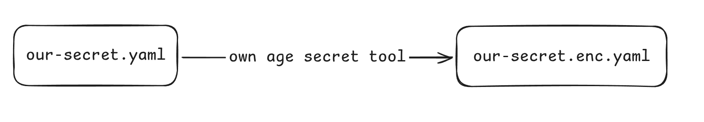

# Kubernetes Operators in Python

## Requirements

- [kind](https://kind.sigs.k8s.io) (or some local Kubernetes installation like k3s, minikube)
- Python 3.10+
- [uv](https://github.com/astral-sh/uv)
- [kubectl](https://kubernetes.io/docs/reference/kubectl/)
- [k9s](https://k9scli.io)

## First steps - Prepare environment

0. Install all requirements

1. Start your local cluster

```shell
kind create cluster
```

We should get something like:
```
Creating cluster "kind" ...
 ✓ Ensuring node image (kindest/node:v1.32.2) 🖼
 ✓ Preparing nodes 📦
 ✓ Writing configuration 📜
 ✓ Starting control-plane 🕹️
 ✓ Installing CNI 🔌
 ✓ Installing StorageClass 💾
Set kubectl context to "kind-kind"
You can now use your cluster with:

kubectl cluster-info --context kind-kind

Have a nice day! 👋
```

Check if kubeconfig is properly loaded:

```shell
kubectl get pods -A
```

### Deploy sample app

Next you can deploy sample web application written in Flask and yes it's inspired by [Severance](https://www.imdb.com/title/tt11280740/).

1. Create namespace

This is a "folder", where application will live.

```shell
kubectl explain namespace
kubectl create namespace development --dry-run=client --output=yaml > app/manifests/namespace.yaml
kubectl apply -f app/manifests/namespace.yaml
```

2. Create a super-duper secret

```shell
kubectl explain secret
kubectl create secret generic numbers \
    --dry-run=client \
    --output=yaml \
    --from-file=numbers=secret.txt > app/manifests/secret.yaml
kubectl apply -n development -f app/manifests/secret.yaml
```

3. Write a deployment*

> \* Not really, just change add reference to secret, that application is using.

- Check the app for usage of secret
- Create deployment
- Reference secret

```shell
kubectl create deployment application \
    --image=app:latest \
    --dry-run=client \
    --output=yaml > app/manifests/deployment.yaml
```

When in doubt use `kubectl explain deployment.spec.template.spec`

```yaml
volumes:
- name: secret
  secret:
    secretName: numbers
```

```yaml
volumeMounts:
  - mountPath: "/app/secret.txt"
    name: secret
    readOnly: true
    subPath: numbers
```

Also don't forget to add this due to kind and kubernetes fun:

```yaml
imagePullPolicy: IfNotPresent
```

And configure ports of your application

```yaml
ports:
  - containerPort: 5000
    protocol: tcp
    name: web
```

3. Deploy and fail...


```shell
kubectl apply -n development -f app/manifests/deployment.yaml
```

Go to k9s and check your deployment.

```shell
k9s
```

- Jump to `development` ns
- Hit `d` and scroll down

4. Solve the issue!

We are going to use [docker bake](https://docs.docker.com/build/bake)

```shell
TAG=v1.0.0 docker buildx bake app
```

Followed by `kind load docker-image app:latest` and to verify:

```shell
docker exec -it kind-control-plane crictl images
```

5. But I want operators!!!

Jump to next section then!

### Develop Operator

1. Let's start with basics

```shell
cd operator
uv init .
```

Install dependency [kopf](https://kopf.readthedocs.io), this is an API that will allow us to
talk to Kubernetes API.

Let's start with some basics:

```python3
import kopf
import logging

@kopf.on.update('deployment')
def my_handler(spec, old, new, diff, **_):
    logging.info(f"A handler is called with body: {spec}")
```

```shell
uv run kopf run operator.py -n development
```

You liar!!

> [!CAUTION]
> This is a `controller` not `operator` as it only works with Kubernetes native objects!

## Pause! What are we actually doing?

We are going to create a secrets that can be stored in repository and later
decrypted in kubernetes cluster!




## Operators!

We start by defining [CRD](https://kubernetes.io/docs/concepts/extend-kubernetes/api-extension/custom-resources/) stands for Custom Resource definition, basically extending Kubernetes API.

1. Write a CRD

```yaml
apiVersion: apiextensions.k8s.io/v1
kind: CustomResourceDefinition
metadata:
  name: agesecrets.pyvo.io
spec:
  scope: Namespaced
  group: pyvo.io
  names:
    kind: AgeSecret
    plural: agesecrets
    singular: agesecret
    shortNames:
      - asec
      - agesec
  versions:
    - name: v1
      served: true
      storage: true
      schema:
        openAPIV3Schema:
          description: Age Secret generator
          type: object
          properties:
            spec:
              type: object
              properties:
                ageSecretRef:
                  description: "Kubernetes secret containg secretKey: AGE-SECRET-KEY-xxx"
                  type: string
                secretName:
                  description: "Name of newly generated secret"
                  type: string
                secretKey:
                  description: "Key of generated secret"
                  type: string
                secret:
                  description: "Base64 encoded encrypted age secret"
                  type: string
            status:
              type: object
              x-kubernetes-preserve-unknown-fields: true
```

Check our spec with explain:

```shell
kubectl explain agesecrets.spec
```

3. Use CRD!

```yaml
apiVersion: pyvo.io/v1
kind: AgeSecret
metadata:
  name: my-secret
spec:
  ageSecretRef: namespace-secret
  secretName: macrodata-numbers
  secretKey: numbers
  secret: "Hello world!"
```

And create a namespace-secret that will contain decrypting secret

> [!TIP]
> This secret can be auto generated or manually applied to the cluster.
> So that only few people have access.

```yaml
apiVersion: v1
kind: Secret
metadata:
  name: namespace-secret
stringData:
  secretKey: "AGE-SECRET-KEY-1WU6V2ZS76MU79G2427F7HD4HPXYQ48HTZG95N3P4XR22A7C4SH9SA6TMFY"
```

3. Let's encrypt with python

This simple script creates our `Kind` it's a simple utility. First, create a set of
key pairs with age:

```shell
age-keygen -o local.txt
age-keygen -o kubernetes.txt
```

5. Change our Operator

```python3
import kopf
import logging

@kopf.on.update('agesecrets')
def my_handler(spec, old, new, diff, **_):
    logging.info(f"A handler is called with body: {spec}")
```

```shell
uv run kopf run operator.py -n development
```
