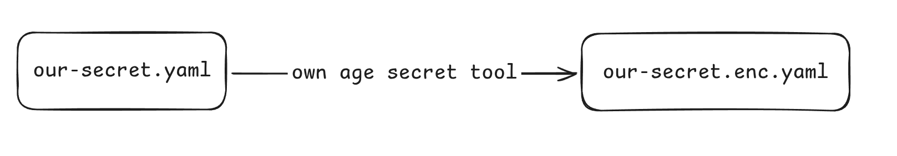
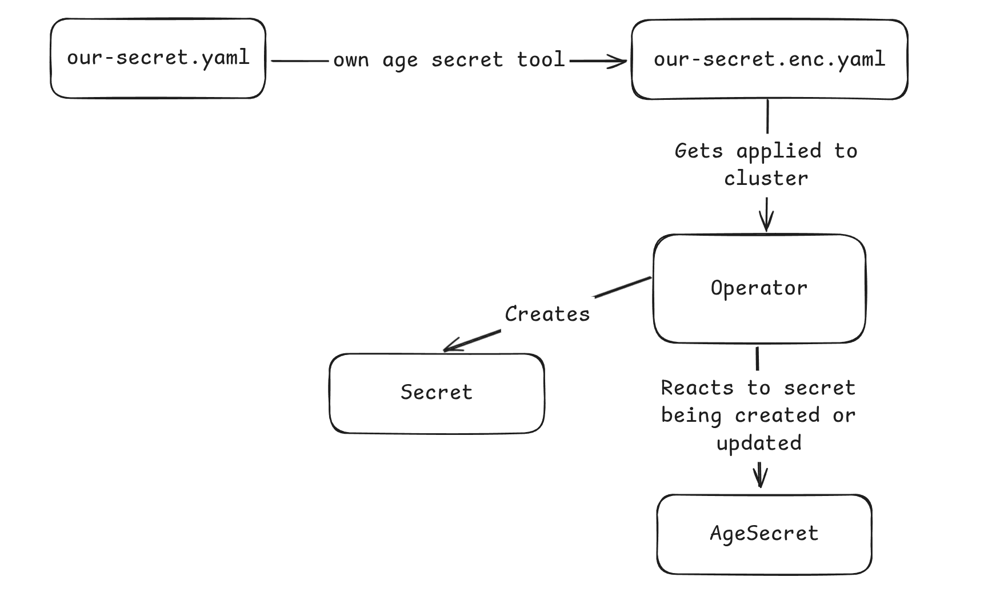

# Kubernetes Operators in Python

This is a material used during public talk at Pyvo.

- https://www.facebook.com/events/9075402249196187

## Requirements

- [kind](https://kind.sigs.k8s.io) (or some local Kubernetes installation like k3s, minikube)
- Python 3.10+
- [uv](https://github.com/astral-sh/uv)
- [kubectl](https://kubernetes.io/docs/reference/kubectl/)
- [k9s](https://k9scli.io)

## First steps - Prepare environment

0. Install all requirements

1. Start your local cluster

```shell
kind create cluster
```

We should get something like:
```
Creating cluster "kind" ...
 ✓ Ensuring node image (kindest/node:v1.32.2) 🖼
 ✓ Preparing nodes 📦
 ✓ Writing configuration 📜
 ✓ Starting control-plane 🕹️
 ✓ Installing CNI 🔌
 ✓ Installing StorageClass 💾
Set kubectl context to "kind-kind"
You can now use your cluster with:

kubectl cluster-info --context kind-kind

Have a nice day! 👋
```

Check if kubeconfig is properly loaded:

```shell
kubectl get pods -A
```

> [!TIP]
> Use `kind delete cluster` later to destroy cluster.

### Deploy sample app

Next you can deploy sample web application written in Flask and yes it's inspired by [Severance](https://www.imdb.com/title/tt11280740/).

1. Create namespace

This is a "folder", where application will live and it will contain all future resources.

```shell
kubectl explain namespace
kubectl create namespace development --dry-run=client --output=yaml > manifests/namespace.yaml
kubectl apply -f manifests/namespace.yaml
```

2. Create a super-duper secret

This secret is required by application `app/app.py` to display data.

```shell
kubectl explain secret
kubectl create secret generic numbers \
    --dry-run=client \
    --output=yaml \
    --from-file=numbers=secret.txt > app/manifests/secret.yaml

kubectl apply -n development -f app/manifests/secret.yaml
```

3. Write a deployment*

This yaml defines application deployment in kubernetes, it's similar to `service` in `docker-compose.yaml`.
> \* Not really, just change add reference to secret, that application is using.

- Create deployment using command below
- Reference a secret, don't forget to check where secret is used

```shell
kubectl create deployment application \
    --image=app:latest \
    --dry-run=client \
    --output=yaml > app/manifests/deployment.yaml
```

With `docker.io/library/app:v1.0.1` as our image. When in doubt use `kubectl explain deployment.spec.template.spec`

```yaml
volumes:
- name: secret
  secret:
    secretName: numbers
```

```yaml
volumeMounts:
  - mountPath: "/app/secret.txt"
    name: secret
    readOnly: true
    subPath: numbers
```

Also don't forget to add this due to `kind` and Kubernetes fun:

```yaml
imagePullPolicy: IfNotPresent
```

And configure ports of your application, so we can portforward to it.

```yaml
ports:
  - containerPort: 5000
    protocol: tcp
    name: web
```

3. Deploy and fail...

Now apply deployment to the cluster and observe what will happen.

```shell
kubectl apply -n development -f app/manifests/deployment.yaml
```

Go to k9s and check your deployment.

```shell
k9s
```

- Jump to `development` ns
- Hit `d` and scroll down

4. Solve the issue!

We are going to use [docker bake](https://docs.docker.com/build/bake), to build our image.

```shell
TAG=v1.0.0 docker buildx bake app
```

Followed by `kind load docker-image app:latest` and to verify:

```shell
docker exec -it kind-control-plane crictl images
```

Now you can port-forward application and view it in the browser on `localhost:5000`.
But I want operators!!! Where is my operator?! **Jump to next section then!**

### Developing Operator (sort-of)

1. Let's start with basics

```shell
cd operator
```

Install dependency [kopf](https://kopf.readthedocs.io), this is an API that will allow us to
talk to Kubernetes API and listen for various events.

Let's start with some basics:

```shell
uv run kopf run controler.py -n development
```

You liar!!

> [!CAUTION]
> This is a `controller` not `operator` as it only works with Kubernetes native objects!

## Pause! What are we actually doing?

We are going to create a secrets that can be stored in repository and later
decrypted in kubernetes cluster via age!



## What is age?

A simple, modern and secure encryption tool (and Go library) with small explicit keys, no config options, and UNIX-style composability.

See: [age-encryption.org](https://age-encryption.org)

```shell
$ age-keygen -o key.txt
Public key: age1ql3z7hjy54pw3hyww5ayyfg7zqgvc7w3j2elw8zmrj2kg5sfn9aqmcac8p
$ tar cvz ~/data | age -r age1ql3z7hjy54pw3hyww5ayyfg7zqgvc7w3j2elw8zmrj2kg5sfn9aqmcac8p > data.tar.gz.age
$ age --decrypt -i key.txt data.tar.gz.age > data.tar.gz
```

## Operators, finally!

We start by defining [CRD](https://kubernetes.io/docs/concepts/extend-kubernetes/api-extension/custom-resources/) stands for Custom Resource definition, basically extending Kubernetes API.

1. Write a CRD

```yaml
apiVersion: apiextensions.k8s.io/v1
kind: CustomResourceDefinition
metadata:
  name: agesecrets.pyvo.io
spec:
  scope: Namespaced
  group: pyvo.io
  names:
    kind: AgeSecret
    plural: agesecrets
    singular: agesecret
    shortNames:
      - asec
      - agesec
  versions:
    - name: v1
      served: true
      storage: true
      schema:
        openAPIV3Schema:
          description: Age Secret generator
          type: object
          properties:
            spec:
              type: object
              properties:
                secretName:
                  description: "Name of newly generated secret"
                  type: string
                secretKey:
                  description: "Key of generated secret"
                  type: string
                secret:
                  description: "Base64 encoded encrypted age secret"
                  type: string
            status:
              type: object
              x-kubernetes-preserve-unknown-fields: true
```

Check our spec with explain:

```shell
kubectl explain agesecrets.spec
```

3. Use CRD!

Now, utilize CRD by writing an object that uses that CRD.

```yaml
apiVersion: pyvo.io/v1
kind: AgeSecret
metadata:
  name: my-secret
spec:
  secretName: macrodata-numbers
  secretKey: numbers
  secret: "Hello world!"
```

Save it to `app/manifests/age.secret.yaml` and apply to the cluster with `kubectl apply -f`.

4. Let's encrypt/decrypt with python + age

First create a set of key pairs with `age-keygen`:

```shell
age-keygen -o local.txt # This will be used by developers
age-keygen -o kubernetes.txt # Just for kubernetes operator
```

Test age encryption and decryption, use `kubernetes.txt` and `local.txt` as recepients.

> [!IMPORTANT]
> Replace it with generated public keys from previous step

```shell
age -o secret.enc.txt \
  -r age1rmupn8vj5ykfp33w9ln8dp58u899j3n6wj527yueul2twrl55s7qy2m26t \
  -r age1eec0y4vnmspzmx8ll54p5staszme0xettz7xyclzn0pd55y8fyvqs87u3q \
  secret.txt
```

Next encryp secret:

```shell
age --decrypt -i local.txt -o secret.dec.txt secret.enc.txt
```

> [!TIP]
> Now, checkout age-secret utility that does the same thing but it uses our CRD format!

5. Deploy our secret

Encrypt secret in yaml using our tool.

```
uv --directory age-secret run age.py encrypt --file ../app/manifests/age.secret.yaml \
  -r age1rmupn8vj5ykfp33w9ln8dp58u899j3n6wj527yueul2twrl55s7qy2m26t \
  -r age1eec0y4vnmspzmx8ll54p5staszme0xettz7xyclzn0pd55y8fyvqs87u3q > ../app/manifests/age.secret.enc.yaml
```

> [!TIP]
> You can configure `.gitignore` to ignore `*.secret.yaml`, so they won't end-up in repository
> `.enc` means that file is encrypted.

Redirect output to `app/manifests/age-secret.enc.yaml` followed by `kubectl apply -f app/manifests/age-secret.enc.yaml`.

> [!INFO]
> Plot twist: Nothing will happen, we need to change the code for operator first.

Use `k9s` to delete created resource with shortcut `ctrl-d`.

## Support Age secret in Operator



Create a `namespace-secret` that will contain decrypting secret from `kubernetes.txt`.

> [!TIP]
> This secret can be auto generated or manually applied to the cluster.
> So that only few people have access.

```yaml
apiVersion: v1
kind: Secret
metadata:
  name: namespace-secret
stringData:
  secretKey: "AGE-SECRET-KEY-1WU6V2ZS76MU79G2427F7HD4HPXYQ48HTZG95N3P4XR22A7C4SH9SA6TMFY"
```

And save it to `manifests` as `namespace-secret.yaml` and apply.

```shell
kubectl apply -n development -f manifests/namespace-secret.yaml
```

Let's start with **create**, it will listen on `event` that `AgeSecret` resource was created,
then it will read that resource and create a native Kubernetes secret out of it.

Before continuing, we need to install `kubernetes` library to intereact with Kubernetes API to create, delete and edit objects.

```shell
cd operator
cp controler.py operator.py
uv add kubernetes
```

And import it:

```python3
import kopf
import logging
from kubernetes import client
```

Now implement missing functionality in `operator.py`.

<details>
  <summary>Spoiler !</summary>

  ```python3
    import base64
    from kubernetes import client

    def create_k8s_secret(name, namespace, key, value):
      api = client.CoreV1Api()
      secret = client.V1Secret(
          metadata=client.V1ObjectMeta(name=name),
          # Yes, kubernetes secrets are stored in base64
          data={key: base64.b64encode(value.encode()).decode('ascii')},
          # https://kubernetes.io/docs/concepts/configuration/secret/#secret-types
          type="Opaque"
      )
      api.create_namespaced_secret(namespace, body=secret)
  ```
    Usage

  ```python3
    create_k8s_secret(secret_name, namespace, secret_key, secret_value)
  ```

</details>

Now test it.

```shell
uv run kopf run operator.py -n development
```

Apply secret and observe what will happen.

```shell
kubectl apply -n development -f manifests/age.secret.yaml
```

If you are lucky you should see new `Secret` with the name from `AgeSecret`.

Next stop, delete event, where native `Secret` kind is removed when `AgeSecret` is deleted.

<details>
  <summary>Spoiler !</summary>

  ```python3
  def delete_k8s_secret(name, namespace):
      api = kubernetes.client.CoreV1Api()
      api.delete_namespaced_secret(name, namespace)
      kopf.info(f"Secret {name} deleted successfully from {namespace}.")

  @kopf.on.delete('pyvo.io', 'v1', 'agesecrets')
  def on_delete(spec, namespace, **kwargs):
      secret_name = spec.get('secretName')
      delete_k8s_secret(secret_name, namespace)
  ```

</details>

Updating secret is quite similar, feel free to implement it on your own.

```shell
uv add pyrage
```

Implement a logic of reading a Kubernetes Secret and reference decryption key in our CRD.

<details>
  <summary>Spoiler !</summary>

  Extend CRD to contain:
  ```yaml
    ageSecretRef:
      description: "Kubernetes secret containg secretKey: AGE-SECRET-KEY-xxx"
      type: string
  ```

  And use this code to decrypt secret:
  ```python3
  from pyrage import decrypt, x25519
  def decrypt_secret(ageSecretRef, namespace, secret_value):
      data = read_age_secret(ageSecretRef, namespace)
      decrypting_secret = None
      if "secretKey" in data:
          decrypting_secret = x25519.Identity.from_str(data["secretKey"])
      else:
          pass

      if "ENC[" in secret_value:
          secret_value = secret_value[4:-1]
      else:
          pass

      encrypted_secret = base64.b64decode(secret_value)
      decrypted = decrypt(encrypted_secret, [decrypting_secret])
      return decrypted.decode()
  ```
</details>

And that's it! 🎉 

## Advanced part

- RBAC
- Deployment of Operator
- ServiceAccount

You can learn more at: https://kopf.readthedocs.io/en/latest/deployment, this part won't be covered by talk.
